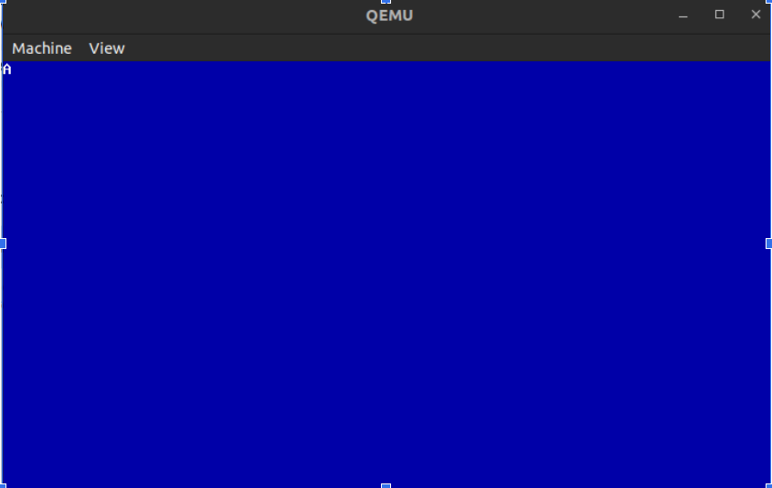
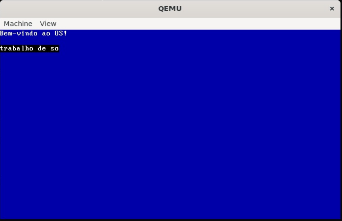

Readme Capítulo 2 e 3 Sistemas Operacionais

Para a realização desse entregável do projeto, separamos o nosso grupo em 2 partes, a primeira parte responsável pelas atividades do capítulo 2 e a segunda parte responsável pelas atividades do capítulo 3\. Apesar disso, o estudo dos dois capítulos de forma integral foi feito por todos.

**Do que se trata o projeto**

Este projeto consiste na implementação base de um kernel de sistema operacional para a arquitetura x86 (IA-32). O desenvolvimento segue as diretrizes dos capítulos iniciais do livro "The Little Book About OS Development" e tem como objetivo estabelecer a infraestrutura mínima necessária para o funcionamento de um SO.

As funcionalidades implementadas englobam:

* **Boot via GRUB:** Utilização do Multiboot Specification para carregar o kernel na memória.

* **Kernel Entry Point (Assembly):** Escrita do carregador inicial (`loader.s`) em Assembly (NASM) para definir o "número mágico" e passar o controle para o sistema.

* **Ambiente de Execução C:** Configuração da pilha (stack) em memória para permitir a execução segura de código em C.  
  
* **Integração Assembly-C:** Implementação da chamada de funções C (`kmain`) a partir do código Assembly, utilizando a convenção de chamada `cdecl`.

* **Build System:** Criação de uma imagem ISO bootável contendo o kernel e o bootloader.

O resultado final desta etapa é um sistema capaz de bootar em um emulador (como o Qemu), configurar a stack e executar uma função principal em C, servindo como fundação para funcionalidades mais avançadas como gerenciamento de memória e drivers de I/O.

Cap 2: Heitor Gabriel, Victória Estrela.

Nos reunimos para a utilização da mesma máquina, Victória ficou responsável pela base do código do sistema operacional, sendo estes o loader.s e o [linker.ld](http://linker.ld). Heitor ficou responsável por instruir o grupo sobre a instalação e utilização das ferramentas, tais como o qemu, genisoimage, bochs, nasm e etc. Além disso, Heitor fez o menu.lst e adicionou um fundo azul no SO. Dessa forma, nos reunimos posteriormente quando o capítulo 3 foi finalizado para a análise do makefile e integração com C.

Cap 3: Bruno Costa, Jorge Alberto e Gabriel Aguiar

* Setup da stack para execução de código C (Bruno)  
* Criação de um struct que representa um caractere VGA para teste do código C (Bruno)  
* Chamada do kmain.c no loader.s (Gabriel)  
* Criação de um makefile (Jorge)

**Imagem do Sistema Operacional**

  
   
  <em>Figura 1: Boot via GRUB e execução da função kmain[cite: 7, 10].</em>

Imagem do SO rodando no QEMU, colocamos um fundo azul e um caractere ‘A’ para confirmar a funcionalidade do código C

**Guia para executar**

*Dependências necessárias:*

sudo apt update  
sudo apt install build-essential nasm genisoimage qemu-system-x86 gcc-multilib make

Para rodar:   
make run

Para apagar os arquivos compilados (`.o`, `.elf`, `.iso`) e limpar a pasta:

make clean

Ainda não há funcionalidades, portanto não necessita de instruções de uso.

### **Readme Capítulo 4 ao 9**

Para a realização desse entregável do projeto, cada integrante ficou responsável com um capítulo (exceto o capítulo 8, que era apenas introdução para o capítulo 9\)

**Do que se trata o projeto neste ponto:** Além do kernel e implementação de stack feitas anteriormente, configuramos drives de serial e framebuffers (formas de comunicação do hardware com o kernel), permitindo a exibição de informações na tela do sistema operacional e o registro de logs para o desenvolvedor. Além disso, segmentamos a memória do sistema operacional, aplicamos uma base de interrupts para ele, e funcionalidades de paginação e modo do usuário. Resumindo, o projeto agora trata-se de um sistema operacional com kernel robusto, executando ininterruptamente no nível máximo de privilégio (Ring 0). O sistema já consegue comunicar com o exterior, lidar com eventos assíncronos de hardware e gerir de forma autónoma a sua própria arquitetura de memória.

### **Responsabilidade de cada um:**

### **Capítulo 4: Drivers de Serial e Framebuffer**

**Responsável:** Heitor

Desenvolvimento de drivers para permitir que o kernel se comunique com o hardware, criando abstrações para facilitar a exibição de informações e o registro de logs.

**Formas utilizadas para comunicação com o hardware:**

* **Memory-Mapped I/O (E/S mapeada em memória):** Usado para o Framebuffer, onde escrever em endereços específicos de memória (como 0x000B8000) altera o que é exibido na tela.  
* **I/O Ports (Portas de E/S):** Usado para o Cursor e Portas Seriais, utilizando as instruções de assembly out e in para enviar e receber dados.

**Implementações:**

* Para implementar a exibição de informações (saída de texto) foi utilizado o framebuffer, funções de escrita (fb\_write) e o controle do cursor (movimento e piscar).  
* Também foi configurada uma porta serial para criação de logs, aplicando configuração de linha, controle de fluxo e sincronização.

### **Capítulo 5: Global Descriptor Table (GDT)**

**Responsável:** Victória

Nesta etapa do projeto, implementei a Tabela de Descritores Globais (GDT), essencial para que o processador x86 entenda como a memória está dividida e quais as permissões de cada segmento no Modo Protegido.

**O que foi implementado:**

* **Estrutura da GDT:** Definição dos descritores de segmento de código e dados para o Kernel.  
* **Inicialização em C:** Criação das funções em gdt.c para configurar os limites e acessos de cada entrada da tabela.  
* **Rotina em Assembly:** Implementação em gdt\_asm.s para carregar a tabela usando a instrução lgdt e realizar o far jump necessário para atualizar o registrador CS.  
* **Segmentação:** Configuração dos segmentos básicos (Null, Kernel Code e Kernel Data).

### **Capítulo 6: Interrupt Descriptor Table (IDT) e Teclado**

**Responsável:** Bruno

**Implementações:**

* **Configuração da IDT:** Montei a tabela que avisa o processador para onde pular quando um evento acontece. Mapeamos desde falhas críticas (como divisão por zero e double fault) até sinais de periféricos.  
* **Ponte segura entre Assembly e C:** Para o SO não quebrar ao ser interrompido, criei rotinas em Assembly (ISRs) que salvam o estado inteiro da CPU na pilha antes de chamar o código em C. Depois que o C resolve o problema, o Assembly restaura tudo e o sistema continua de onde parou como se nada tivesse acontecido.  
* **Remapeamento do PIC:** Tive que conversar direto com o hardware do Programmable Interrupt Controller via portas I/O para remapear os sinais. Joguei as interrupções de hardware (timer, teclado) para depois do número 31, evitando que a CPU confundisse um clique do teclado com um erro fatal do sistema.  
* **Primeiro Driver de Teclado:** A parte mais visual do projeto até agora. O SO foi configurado para ouvir a porta 0x60. Escrevi a lógica para ler os scan codes brutos, ignorar os sinais de "tecla solta" e usar um array de tradução para converter o sinal do hardware em caracteres da tabela ASCII, jogando tudo direto na memória de vídeo (framebuffer).

### **Capítulo 7: Módulos**

**Responsável:** Jorge

Desenvolvimento de um sistema de módulos para a execução de um programa, por enquanto, em modo Kernel, mas que será essencial no futuro para implementação do modo Usuário.

**Etapas de implementação:**

* Criação de um diretório de onde o GRUB irá carregar os módulos.  
* Instruir o GRUB a alinhar esses módulos na memória de acordo com as páginas.  
* Escrever um programa simples que guarda um valor fácil de se distinguir (como o valor 0xDEADBEEF) no registrador eax e depois entra em loop.  
* Depois, basta encontrar o módulo carregado na memória através do endereço armazenado em ebx e executar o programa.  
* Finalmente, checamos o serial para ver se o valor escolhido está realmente dentro de eax.

### **Capítulos 8 e 9: Gerenciamento de Memória e Modo de Usuário**

**Responsável:** Gabriel

Nestes capítulos, o sistema operacional dá um grande passo em direção à estabilidade e à segurança, implementando a memória virtual e a capacidade de executar programas de forma isolada.

**Implementações do Capítulo 8 (Gerenciamento de Memória):**

* **Paginação (Paging):** Configuração dos diretórios e tabelas de páginas para mapear endereços virtuais em endereços físicos, permitindo que cada processo ache que tem a memória inteira só para ele.  
* **Alocador de Memória (Page Frame Allocator):** Implementação de um sistema para rastrear, alocar e liberar "quadros" de página na memória RAM física disponível.

**Implementações do Capítulo 9 (Modo de Usuário e Syscalls):**

* **Task State Segment (TSS):** Configuração da estrutura necessária no x86 para que o processador saiba onde está a pilha do Kernel caso ocorra uma interrupção enquanto um programa comum estiver rodando.  
* **Transição para o Ring 3 (User Mode):** Implementação da lógica em Assembly para rebaixar os privilégios da CPU, saindo do controle total do Kernel (Ring 0\) e entrando no Modo de Usuário restrito (Ring 3).  
* **System Calls:** Criação de uma interface segura (geralmente usando a interrupção 0x80) para que programas de usuário possam "pedir" serviços ao Kernel, como escrever textos na tela de forma controlada.

**IMAGEM DO SISTEMA OPERACIONAL**

  
   
  <em>Figura 2: Sistema com segmentação, interrupções e modo de usuário[cite: 41, 107].</em>

**Guia para executar**

*Dependências necessárias:*

sudo apt update  
sudo apt install build-essential nasm genisoimage qemu-system-x86 gcc-multilib make

Para rodar:   
make run

Para apagar os arquivos compilados (`.o`, `.elf`, `.iso`) e limpar a pasta:

make clean

**Funcionalidades neste ponto:** Inicialização Padronizada (Multiboot), Comunicação Visual (Framebuffer), Canal de Depuração (Serial), Privilégio e Segmentação (GDT), Recepção de Eventos (IDT e PIC), Memória Virtual (Paginação).
